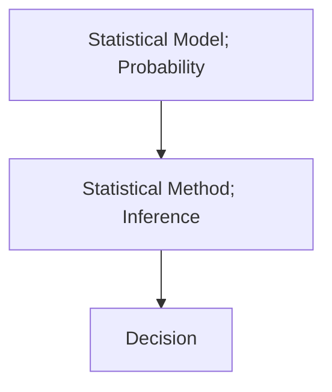

Recall that a statistical model, of the probability of a group, that we apply statistical methods preforming some inference of parameters of our group.  

```mermaid
graph TD;
	A[Statistical Model; Probability] --> B[Statistical Method; Inference];
	B --> C[Decision]
```

